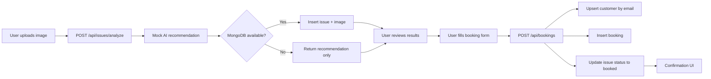

# Admin Dashboard Codebase Analysis

## 1. Executive Summary

**Onehabitat** (`onehabitat-next`) is a marketing and lead-capture web application for a property maintenance and interior services business. The core functional workflow is: a visitor uploads a photo of a home maintenance issue → the app returns a **mock AI analysis** with category, severity, solutions, and cost estimate → the visitor may submit a **service booking** form that persists data to **MongoDB**.

There is **no admin dashboard**, **no authentication**, **no user roles**, and **no admin API routes** in the current codebase. The backend consists of three public, unauthenticated Next.js API route handlers. Marketing content (AMC subscription plans, interiors, handover inspections, service catalog) is largely **static UI** with non-functional placeholder buttons and links.

An admin dashboard would need to be built from scratch on top of the existing MongoDB collections (`issues`, `images`, `customers`, `bookings`) and would require new authenticated admin APIs, role-based access control, booking lifecycle management, and operational tooling that does not exist today.

| Aspect | Current state |
|--------|---------------|
| App purpose | AI-assisted home maintenance issue upload + service booking |
| Frontend | Next.js App Router, React 19, Tailwind CSS 4 |
| Backend | Next.js Route Handlers (`app/api/**`) |
| Database | MongoDB (native driver, no ODM) |
| Auth | **Not found** |
| Admin UI | **Not found** |
| Real AI | **Not found** — uses `mockAnalyzeIssue()` |
| Payments | **Not found** — cost estimates are display strings only |
| Email/notifications | **Not found** |
| Deployment config | Standard Next.js; `.env.example` only documents `MONGODB_URI` |

---

## 2. Tech Stack

| Layer | Technology | Version / Notes |
|-------|------------|-----------------|
| Framework | Next.js (App Router) | 16.2.6 |
| UI library | React | 19.2.4 |
| Language | TypeScript | ^5 |
| Styling | Tailwind CSS | ^4 (`@tailwindcss/postcss`) |
| Icons | material-symbols | ^0.44.10 |
| Database | MongoDB (official driver) | ^7.2.0 |
| Fonts | next/font/google — Manrope, Inter | `lib/fonts.ts` |
| Linting | ESLint + eslint-config-next | ^9 |
| Package name | `onehabitat-next` | `package.json` |

### Frontend framework

- **Next.js App Router** with server and client components
- Pages: `app/page.tsx`, `app/services/page.tsx`
- Root layout: `app/layout.tsx`
- Client-side state for upload/booking flow: `components/onehabitat/UploadIssueProvider.tsx`

### Backend framework

- **Next.js Route Handlers** under `app/api/`
- Node.js runtime explicitly set on image-related routes (`export const runtime = "nodejs"`)
- No separate Express/Fastify server

### Database

- **MongoDB** via `lib/mongodb.ts`
- Connection string from `MONGODB_URI` environment variable (see `.env.example`)
- Default example DB: `mongodb://127.0.0.1:27017/onehabitat`
- Uses default database from connection URI (`client.db()` with no explicit name override)
- **No Mongoose/Prisma** — TypeScript types in `types/database.ts` only

### Authentication method

**Not found.** No NextAuth, Clerk, JWT, session cookies, middleware, or login pages.

### Deployment / config structure

| File | Purpose |
|------|---------|
| `.env.example` | Documents `MONGODB_URI` |
| `.env.local` | Local secrets (gitignored) — **Needs verification** for other vars |
| `next.config.ts` | Remote image pattern for `lh3.googleusercontent.com` |
| `postcss.config.mjs` | Tailwind PostCSS |
| `tsconfig.json` | Path alias `@/*` → project root |
| `.gitignore` | Ignores `.env*`, `.next`, `.vercel` |

**Not found:** `vercel.json`, Docker files, CI/CD workflows (`.github/`), database migration scripts, seed scripts.

---

## 3. Project Structure

```
onehabitat/
├── app/                          # Next.js App Router (pages + API)
│   ├── api/                      # Backend route handlers
│   │   ├── bookings/route.ts
│   │   └── issues/
│   │       ├── analyze/route.ts
│   │       └── [issueId]/image/route.ts
│   ├── layout.tsx                # Root HTML layout
│   ├── page.tsx                  # Home page (/)
│   ├── services/page.tsx         # Services page (/services)
│   └── globals.css               # Design tokens + Tailwind theme
├── components/
│   ├── Navbar.tsx                # Shared navigation
│   ├── onehabitat/               # Active brand components (used on home)
│   ├── proserve/                 # Alternate styling for /services page
│   └── fixora/                   # Duplicate/unused brand variant — not imported
├── lib/                          # Server-side utilities
│   ├── mongodb.ts                # DB connection singleton
│   ├── customers.ts              # Customer upsert logic
│   ├── issue-images.ts           # Image CRUD helpers
│   ├── form-file.ts              # FormData image parsing
│   ├── validation.ts             # Booking/recommendation validators
│   └── fonts.ts                  # Google font loaders
├── types/
│   ├── database.ts               # MongoDB document types
│   ├── upload-issue.ts           # Upload flow types
│   └── index.ts                  # Shared types (NavLink)
├── utils/
│   ├── api.ts                    # Client fetch wrappers
│   ├── constants.ts              # Brand + nav constants
│   ├── currency.ts               # INR formatting
│   └── mockAiAnalysis.ts         # Mock AI recommendations
└── public/                       # Static assets
```

### Folder roles

| Folder | Role |
|--------|------|
| `app/` | Frontend pages + API routes (full-stack in one Next.js app) |
| `components/onehabitat/` | **Active** home-page UI + upload/booking modal flow |
| `components/proserve/` | Header/footer wrappers for `/services` marketing page |
| `components/fixora/` | **Unused** mirror of onehabitat components |
| `lib/` | Shared server logic (DB, validation, file parsing) |
| `types/` | TypeScript interfaces (not enforced at DB level) |
| `utils/` | Client API helpers + constants + mock AI |

### Important files

| File | Importance |
|------|------------|
| `components/onehabitat/UploadIssueProvider.tsx` | Orchestrates entire upload → analyze → book flow |
| `components/onehabitat/UploadIssueModal.tsx` | Multi-step modal UI |
| `app/api/issues/analyze/route.ts` | Creates issue + image in MongoDB |
| `app/api/bookings/route.ts` | Creates booking, upserts customer, updates issue status |
| `types/database.ts` | Canonical schema documentation for MongoDB collections |
| `lib/customers.ts` | Customer deduplication by normalized email |

---

## 4. Screens & Pages

### 4.1 Home Page

| Attribute | Detail |
|-----------|--------|
| **Page name** | Home |
| **File path** | `app/page.tsx` |
| **URL route** | `/` |
| **Purpose** | Marketing landing page + entry point for AI issue upload and booking |
| **User role / access** | Public (no auth) |
| **Layout wrapper** | `UploadIssueProvider` wraps entire page |

#### UI components used

| Component | File |
|-----------|------|
| `OnehabitatHeader` | `components/onehabitat/Header.tsx` → `Navbar` |
| `UploadIssueTrigger` | `components/onehabitat/UploadIssueTrigger.tsx` |
| `MaintenanceCategories` | `components/onehabitat/MaintenanceCategories.tsx` |
| `OnehabitatFooter` | `components/onehabitat/Footer.tsx` |
| `UploadIssueModal` | Rendered by provider when modal open |
| Global `OnehabitatWhatsAppButton` | `app/layout.tsx` |

#### Sections (anchor IDs)

| Section | Anchor | Content type |
|---------|--------|--------------|
| Hero | — | CTA: Upload an Issue, Get Free Consultation |
| How Onehabitat Works | — | 4-step explainer |
| Maintenance Services | — | Tabbed category showcase |
| Comprehensive Property Care | — | 4 service cards (links are `#`) |
| Interiors | `#interiors` | Static marketing |
| Inspections | `#inspections` | Sample snag report mockup |
| AMC Plans | `#amc-plans` | 3 pricing tiers ($49/$99/$199) — **not connected to backend** |
| FAQ | — | `<details>` accordion |
| Contact | `#contact` | Footer contact info |

#### Forms / buttons / actions

| Action | Behavior | API |
|--------|----------|-----|
| **Upload an Issue** (dropdown) | Opens file picker or camera capture → starts modal flow | `POST /api/issues/analyze` |
| Get Free Consultation | Button — **no handler** | None |
| Book Service (MaintenanceCategories) | Button — **no handler** | None |
| Try Detection / Explore Designs / etc. | Links to `#` | None |
| Book a Free Consultation | Button — **no handler** | None |
| View Sample Report | Button — **no handler** | None |
| Subscribe Now (AMC) | Button — **no handler** | None |

#### API calls made

- Indirect via `UploadIssueProvider` → `analyzeIssue()` → `POST /api/issues/analyze`
- On booking submit → `createBooking()` → `POST /api/bookings`

#### Database collections affected

- Via upload flow: `issues`, `images`
- Via booking flow: `bookings`, `customers`, `issues` (status update)

#### Loading / error / empty states

| State | Where | Behavior |
|-------|-------|----------|
| Analyzing | Modal step `analyzing` | Spinner + "Analyzing your issue…" |
| Results | Modal step `results` | Shows AI recommendation; `fileError` banner if DB save failed |
| Booking disabled | Modal | Message when `issueId` is null (MongoDB unavailable) |
| Submit loading | Modal step `booking` | "Submitting…" spinner on confirm |
| Submit error | Modal | Red alert with error message |
| Success | Modal | "Booking Confirmed" with Done button |

#### Data displayed

- Static marketing copy, external Google-hosted images
- Dynamic: AI recommendation fields, uploaded image preview, booking form values

---

### 4.2 Services Page

| Attribute | Detail |
|-----------|--------|
| **Page name** | Services (ProServe styling) |
| **File path** | `app/services/page.tsx` |
| **URL route** | `/services` |
| **Purpose** | Premium/luxury-oriented service catalog marketing page |
| **User role / access** | Public |
| **Upload flow** | **Not present** — no `UploadIssueProvider` on this page |

#### UI components used

| Component | File |
|-----------|------|
| `ProServeHeader` | `components/proserve/Header.tsx` → `Navbar` |
| `ProServeFooter` | `components/proserve/Footer.tsx` |

#### Sections

- Hero ("Architectural Standards in Daily Maintenance")
- Service disciplines: Plumbing, Electrical, Carpentry, Painting, Gardening
- Preventive philosophy
- AMC integration promo
- Service flow (Consultation → Diagnostic → Execution → Post-Care)
- Final CTA

#### Forms / buttons / actions

All buttons (`BOOK SERVICE`, `GET AMC QUOTE`, `Subscribe`, etc.) are **static** with **no onClick handlers** and **no API integration**.

#### API calls made

**None**

#### Database collections affected

**None**

#### Loading / error / empty states

**Not found**

#### Data displayed

Static marketing content and external images only.

---

### 4.3 Root Layout (Global Shell)

| Attribute | Detail |
|-----------|--------|
| **File path** | `app/layout.tsx` |
| **Purpose** | HTML shell, fonts, global CSS, WhatsApp floating button |
| **Metadata** | Title: "Onehabitat - Maintenance that Cares. Interiors That Inspire." |

---

## 5. Modals & Dialogs

### 5.1 Upload Issue Modal (primary interactive UI)

| Attribute | Detail |
|-----------|--------|
| **Modal name** | Upload Issue Modal |
| **File path** | `components/onehabitat/UploadIssueModal.tsx` |
| **State management** | `components/onehabitat/UploadIssueProvider.tsx` |
| **Opened from** | Home page via `UploadIssueTrigger` (hero) after file/camera selection |
| **Trigger action** | User selects image via hidden `<input type="file">` (capture or upload) |

#### Purpose

Multi-step wizard: AI analysis → recommendation review → booking form → confirmation.

#### Steps (`UploadIssueStep`)

| Step | UI title | Content |
|------|----------|---------|
| `analyzing` | AI Analysis | Image preview + loading spinner |
| `results` | Recommendations | Severity badge, category, issue title, summary, solutions list, cost/duration, "Book this service" |
| `booking` | Book Service | Customer booking form |
| *(post-submit)* | Booking Confirmed | Success message (when `isBooked === true`) |

#### Fields shown (booking step)

| Field | Key | Required | Type |
|-------|-----|----------|------|
| Full name | `fullName` | Yes | text |
| Phone | `phone` | Yes | tel |
| Email | `email` | Yes | email |
| Service address | `address` | Yes | text |
| Preferred date | `preferredDate` | Yes | date (min = today) |
| Additional notes | `notes` | No | textarea |

#### Submit / cancel actions

| Action | Handler | Result |
|--------|---------|--------|
| Close (backdrop / X / Escape) | `onClose` → `closeModal()` | Resets all flow state |
| Book this service | `onGoToBooking` | Advances to booking step (disabled if no `issueId`) |
| Back to results | `onBackToResults` | Returns to results step |
| Confirm booking | `onSubmitBooking` | `POST /api/bookings` |
| Done (success) | `onClose` | Closes modal |

#### APIs called

| Step | API |
|------|-----|
| After file select | `POST /api/issues/analyze` (via `utils/api.ts` → `analyzeIssue`) |
| Confirm booking | `POST /api/bookings` (via `createBooking`) |

#### Database collections affected

| Action | Collections |
|--------|-------------|
| Analyze | `issues` (insert + update), `images` (insert) |
| Book | `bookings` (insert), `customers` (upsert), `issues` (status → `booked`) |

#### Validation rules

**Client-side (HTML):**

- Required fields on booking form (`required` attribute)
- `preferredDate` min = today's ISO date string

**Server-side (`lib/validation.ts`):**

| Field | Rule |
|-------|------|
| `fullName` | Non-empty trimmed string |
| `phone` | Non-empty trimmed string |
| `email` | Regex `/^[^\s@]+@[^\s@]+\.[^\s@]+$/` |
| `address` | Non-empty trimmed string |
| `preferredDate` | Non-empty string |
| `notes` | Must be string (can be empty) |
| `recommendation` | Full `AIRecommendation` shape validation |
| `issueId` | Valid MongoDB ObjectId string |

**Analyze route:**

- Valid image file in FormData field `file`
- Max size 5 MB
- Image MIME type or extension check via `lib/form-file.ts`

#### Success / error behavior

| Scenario | Behavior |
|----------|----------|
| Analyze API success | Shows results; `canBook = !!issueId` |
| Analyze API fails | Falls back to client-side `mockAnalyzeIssue()`; shows `fileError` about MongoDB |
| Analyze total failure | Generic fallback recommendation + error message |
| Invalid file type | Opens modal with `fileError` |
| Booking success | `isBooked = true`, confirmation UI |
| Booking failure | `submitError` alert, stays on booking step |
| Missing `issueId` on submit | Client error: "Missing issue details…" |

---

### 5.2 Upload Issue Trigger Dropdown (mini-menu, not a modal)

| Attribute | Detail |
|-----------|--------|
| **File path** | `components/onehabitat/UploadIssueTrigger.tsx` |
| **Type** | Popover menu (`role="menu"`) |
| **Actions** | "Capture a photo" → `triggerCapture()`; "Upload from device" → `triggerUpload()` |

---

### 5.3 Mobile Navigation Menu

| Attribute | Detail |
|-----------|--------|
| **File path** | `components/Navbar.tsx` → `MobileNavMenu` |
| **Trigger** | Hamburger button on viewports `< lg` |
| **Purpose** | Mobile nav links + Contact CTA |

---

### 5.4 Unused modal duplicate

| Attribute | Detail |
|-----------|--------|
| **File path** | `components/fixora/UploadIssueModal.tsx` (and related fixora provider/trigger) |
| **Status** | **Not imported anywhere** — legacy/alternate brand copy |

---

## 6. API Inventory

### 6.1 POST `/api/issues/analyze`

| Attribute | Detail |
|-----------|--------|
| **File path** | `app/api/issues/analyze/route.ts` |
| **Method** | POST |
| **Purpose** | Accept issue image, run mock AI analysis, persist issue + image to MongoDB |
| **Auth** | **None** — fully public |
| **Runtime** | `nodejs` |

#### Request

| Part | Detail |
|------|--------|
| Content-Type | `multipart/form-data` |
| Body field | `file` — image file |
| Max size | 5 MB |

#### Response (200)

```json
{
  "issueId": "string | null",
  "imageId": "string | null",
  "recommendation": { /* AIRecommendation */ },
  "saved": true | false
}
```

#### Services / controllers used

- `parseImageFromFormData()` — `lib/form-file.ts`
- `mockAnalyzeIssue()` — `utils/mockAiAnalysis.ts`
- `getDb()` — `lib/mongodb.ts`
- `saveIssueImage()` — `lib/issue-images.ts`

#### Database collections

| Collection | Operation |
|------------|-----------|
| `issues` | `insertOne`, then `updateOne` (set `imageId`) |
| `images` | `insertOne` via `saveIssueImage` |

#### Error cases

| Status | Condition |
|--------|-----------|
| 400 | No valid image / over 5 MB |
| 500 | Unexpected server error |
| *(graceful)* | DB failure logged; returns 200 with `issueId: null`, `saved: false` |

#### Admin dashboard relevance

- **Issues list/detail** — source of all analyzed issues
- **Image review** — links to `GET /api/issues/[issueId]/image`
- **AI audit** — today returns random mock data; admin may need to review/replace recommendations
- **Analytics** — issue volume, category/severity breakdown, conversion to booked

---

### 6.2 POST `/api/bookings`

| Attribute | Detail |
|-----------|--------|
| **File path** | `app/api/bookings/route.ts` |
| **Method** | POST |
| **Purpose** | Create booking, upsert customer, mark issue as booked |
| **Auth** | **None** — fully public |

#### Request

| Part | Detail |
|------|--------|
| Content-Type | `application/json` |
| Body | `{ issueId, booking, recommendation }` |

#### Response (200)

```json
{
  "bookingId": "string",
  "customerId": "string",
  "issueId": "string"
}
```

#### Services used

- `isValidBooking()`, `isValidRecommendation()` — `lib/validation.ts`
- `upsertCustomerFromBooking()` — `lib/customers.ts`
- `getDb()` — `lib/mongodb.ts`

#### Database collections

| Collection | Operation |
|------------|-----------|
| `issues` | `findOne`, `updateOne` (status → `booked`) |
| `customers` | upsert by `email` |
| `bookings` | `insertOne` |

#### Error cases

| Status | Condition |
|--------|-----------|
| 400 | Invalid issueId, booking, or recommendation |
| 404 | Issue not found |
| 500 | Server error |

#### Admin dashboard relevance

- **Bookings management** — primary operational queue for admins
- **Customer CRM** — linked via `customerId`
- **Issue status** — transitions `analyzed` → `booked`
- **Missing:** booking status workflow beyond issue-level flag

---

### 6.3 GET `/api/issues/[issueId]/image`

| Attribute | Detail |
|-----------|--------|
| **File path** | `app/api/issues/[issueId]/image/route.ts` |
| **Method** | GET |
| **Purpose** | Serve binary image for an issue |
| **Auth** | **None** — fully public (anyone with issueId can fetch) |
| **Runtime** | `nodejs` |

#### Request params

| Param | Validation |
|-------|------------|
| `issueId` | Must be valid ObjectId |

#### Response

| Case | Response |
|------|----------|
| Success | Binary body with `Content-Type`, `Content-Length`, `Cache-Control: private, max-age=3600` |
| Legacy issue | Decodes embedded base64 from `issue.image.data` |
| Not found | 404 JSON `{ error: "Image not found" }` |
| Invalid ID | 400 JSON |
| Server error | 500 JSON |

#### Database collections

| Collection | Operation |
|------------|-----------|
| `images` | `findOne({ issueId })` |
| `issues` | `findOne` (legacy fallback) |

#### Admin dashboard relevance

- Issue detail view thumbnail/full image
- **Security risk:** public unauthenticated image access — admin dashboard should use authenticated proxy or signed URLs

---

### 6.4 Client API utilities

| Function | File | Endpoint |
|----------|------|----------|
| `analyzeIssue(file)` | `utils/api.ts` | `POST /api/issues/analyze` |
| `createBooking(payload)` | `utils/api.ts` | `POST /api/bookings` |

**Not found:** GET list endpoints, PATCH/DELETE endpoints, admin endpoints.

---

## 7. Database Collections & Schemas

MongoDB collections are inferred from code usage. **No formal schema enforcement, migrations, or indexes defined in codebase.**

### 7.1 `issues`

| Attribute | Detail |
|-----------|--------|
| **Type definition** | `IssueDocument` in `types/database.ts` |
| **File references** | `app/api/issues/analyze/route.ts`, `app/api/bookings/route.ts`, `app/api/issues/[issueId]/image/route.ts` |

#### Fields

| Field | Type | Required | Notes |
|-------|------|----------|-------|
| `_id` | ObjectId | Auto | MongoDB default |
| `imageId` | ObjectId | Optional | Reference to `images` collection |
| `image` | `IssueImageMeta` \| `StoredIssueImageLegacy` | Optional | Meta after save; legacy has embedded base64 |
| `recommendation` | `AIRecommendation` | Yes | Full AI result snapshot |
| `status` | `"analyzed"` \| `"booked"` | Yes | Only two states |
| `createdAt` | Date | Yes | Set on insert |
| `updatedAt` | Date | Yes | Updated on image link + booking |

#### `AIRecommendation` nested shape

| Field | Type |
|-------|------|
| `detectedIssue` | string |
| `category` | string |
| `severity` | `"low"` \| `"medium"` \| `"high"` |
| `summary` | string |
| `solutions` | string[] |
| `estimatedCost` | string (display, e.g. `"₹650 – ₹4,200"`) |
| `estimatedDuration` | string |

#### Relationships

- `imageId` → `images._id`
- Referenced by `bookings.issueId`
- Referenced by `images.issueId`

#### Indexes / unique fields

**Not found** in codebase. Recommended: `status`, `createdAt`, `recommendation.category`, `recommendation.severity`.

#### APIs read/write

| API | Read | Write |
|-----|------|-------|
| POST `/api/issues/analyze` | — | insert, update |
| POST `/api/bookings` | findOne | update status |
| GET `/api/issues/[issueId]/image` | findOne (legacy) | — |

#### Screens

- Upload modal (indirect — via API responses, not DB reads on client)

#### Admin dashboard use cases

- Issue inbox (analyzed vs booked)
- Filter by category, severity, date
- View AI recommendation + linked image
- Manually update status, reassign category, override estimate
- Flag low-quality uploads

---

### 7.2 `images`

| Attribute | Detail |
|-----------|--------|
| **Type definition** | `ImageDocument` in `types/database.ts` |
| **Helper** | `lib/issue-images.ts` |

#### Fields

| Field | Type | Required |
|-------|------|----------|
| `_id` | ObjectId | Auto |
| `issueId` | ObjectId | Yes |
| `fileName` | string | Yes |
| `mimeType` | string | Yes |
| `data` | Buffer | Yes |
| `sizeBytes` | number | Yes |
| `createdAt` | Date | Yes |

#### Relationships

- `issueId` → `issues._id` (one image per issue via `findOne({ issueId })`)

#### Indexes

**Not found.** Recommended: unique index on `issueId`.

#### APIs

| API | Operation |
|-----|-----------|
| POST `/api/issues/analyze` | insert |
| GET `/api/issues/[issueId]/image` | read |

#### Admin use cases

- Image gallery per issue
- Storage usage monitoring (binary in MongoDB — operational concern)
- Migrate to object storage (S3/GCS) — not implemented

---

### 7.3 `customers`

| Attribute | Detail |
|-----------|--------|
| **Type definition** | `CustomerDocument` in `types/database.ts` |
| **Logic** | `lib/customers.ts` → `upsertCustomerFromBooking` |

#### Fields

| Field | Type | Required | Default |
|-------|------|----------|---------|
| `_id` | ObjectId | Auto | — |
| `fullName` | string | Yes | From latest booking |
| `phone` | string | Yes | From latest booking |
| `email` | string | Yes | Normalized lowercase |
| `address` | string | Yes | From latest booking |
| `bookingCount` | number | Yes | `$inc: 1` on each booking |
| `createdAt` | Date | On insert | `$setOnInsert` |
| `updatedAt` | Date | Yes | On each upsert |

#### Relationships

- Referenced by `bookings.customerId`

#### Indexes

**Not found.** Upsert key is `email` — **should have unique index on `email`**.

#### APIs

| API | Operation |
|-----|-----------|
| POST `/api/bookings` | upsert |

#### Admin use cases

- Customer directory / CRM
- Repeat customer identification via `bookingCount`
- Contact history (needs join with bookings — no API)

---

### 7.4 `bookings`

| Attribute | Detail |
|-----------|--------|
| **Type definition** | `BookingDocument` in `types/database.ts` |

#### Fields

| Field | Type | Required |
|-------|------|----------|
| `_id` | ObjectId | Auto |
| `issueId` | ObjectId | Yes |
| `customerId` | ObjectId | Yes |
| `booking` | `BookingFormData` | Yes | Snapshot of form at booking time |
| `recommendation` | `AIRecommendation` | Yes | Snapshot of AI result |
| `createdAt` | Date | Yes |

#### `BookingFormData` nested shape

| Field | Type |
|-------|------|
| `fullName` | string |
| `phone` | string |
| `email` | string |
| `address` | string |
| `preferredDate` | string (ISO date from `<input type="date">`) |
| `notes` | string |

#### Status / workflow fields

**Not found** on `BookingDocument`. Operational status lives only on parent `issues.status`.

#### Relationships

- `issueId` → `issues._id`
- `customerId` → `customers._id`

#### Indexes

**Not found.** Recommended: `createdAt`, `issueId`, `customerId`, `booking.preferredDate`.

#### APIs

| API | Operation |
|-----|-----------|
| POST `/api/bookings` | insert |

#### Admin use cases

- Booking queue sorted by `preferredDate`
- Assign technician, update status, add internal notes
- Link booking → issue image + AI analysis + customer profile

---

### 7.5 Collections referenced in marketing UI but not in database

| Concept | UI location | DB status |
|---------|-------------|-------------|
| AMC subscriptions | Home `#amc-plans`, Services page | **Not found** |
| Service catalog | `MaintenanceCategories`, Services page | Hardcoded in components |
| Inspection reports | Home `#inspections` | **Not found** |
| Interior projects | Home `#interiors` | **Not found** |
| Payments / orders | Cost estimates in AI results | **Not found** (strings only) |

---

## 8. Roles & Permissions

### User roles identified

**Not found.** The application has no concept of users, roles, or admin accounts.

### Permission logic

**Not found.** All API routes are publicly callable without headers, tokens, or cookies.

### Protected routes

**Not found.** No `middleware.ts`, no route guards, no `(admin)` route group.

### Admin-only actions

**Not found** in current codebase. The following would logically be admin-only but do not exist:

- List/view/edit bookings, issues, customers
- Update booking/issue status
- Override AI recommendations
- Manage service categories / AMC plans
- Export data
- View analytics

### Missing or inconsistent permission checks

| Gap | Risk |
|-----|------|
| Public `POST /api/bookings` | Anyone can create bookings if they know/guess an `issueId` |
| Public `GET /api/issues/[issueId]/image` | Issue images accessible without auth |
| Public `POST /api/issues/analyze` | Unbounded upload/analysis (no rate limiting found) |
| No CSRF protection documented | Standard for public POST from same-origin only |
| Customer PII in MongoDB | No access control on read paths (reads don't exist yet, but admin must enforce) |

---

## 9. Business Workflows

### 9.1 Core workflow: Issue upload → AI analysis → Booking



### 9.2 State transitions

#### Issue status (`IssueStatus`)

| Status | Meaning | Set when |
|--------|---------|----------|
| `analyzed` | Issue created with AI recommendation | `POST /api/issues/analyze` insert |
| `booked` | Customer submitted booking for this issue | `POST /api/bookings` update |

**Not found:** statuses such as `in_progress`, `completed`, `cancelled`, `assigned`.

#### Booking lifecycle

**Not found** — bookings have no status field. Immutable snapshot at creation.

#### Customer lifecycle

- Created or updated on each booking via email-keyed upsert
- `bookingCount` incremented per booking

### 9.3 AI analysis flow

| Step | Implementation |
|------|----------------|
| Server | `mockAnalyzeIssue()` — random pick from 6 predefined recommendations |
| Client fallback | Same mock if API fails |
| Real ML/vision API | **Not found** |

Mock categories in `utils/mockAiAnalysis.ts`:

- Wall & Ceiling, Plumbing, Electrical, Carpentry & Finishing, HVAC & Appliances, Carpentry

### 9.4 Payment / order flow

**Not found.** `estimatedCost` is a formatted INR range string for display only. AMC pricing on home page uses USD (`$49`, `$99`, `$199`) with no checkout.

### 9.5 Notifications / emails / events

**Not found:**

- No email on booking confirmation (UI claims "expert will contact you within 2 hours")
- No SMS/WhatsApp automation (only static WhatsApp link button)
- No webhooks
- No event bus

### 9.6 Background jobs / cron

**Not found**

### 9.7 Marketing-only flows (not implemented)

| Flow | UI promise | Backend |
|------|------------|---------|
| AMC subscription | Subscribe Now buttons | None |
| Free consultation | Multiple CTAs | None |
| Handover inspection booking | Book Inspection link | None |
| Service booking from catalog | Book Service buttons on `/services` | None |

---

## 10. Admin Dashboard Design Requirements

Based on existing data and gaps, the following admin sections are **relevant**. Sections for products/payments/logs are included only where partial data exists or operational need is clear.

---

### 10.1 Dashboard Home

| Attribute | Detail |
|-----------|--------|
| **Purpose** | Operational overview for Onehabitat staff |
| **Data to show** | Total issues (today/week/month), bookings created, conversion rate (booked ÷ analyzed), issues by severity, top categories, new customers |
| **Filters** | Date range (today, 7d, 30d, custom) |
| **Visualizations** | KPI cards, line chart (issues/bookings over time), donut chart (severity), bar chart (category) |
| **Actions** | Quick links to unbooked analyzed issues, today's preferred dates |
| **Related APIs** | **Missing** — needs aggregation endpoints |
| **Related collections** | `issues`, `bookings`, `customers` |
| **UX states** | Loading skeletons, empty state if no data, error banner if stats fail |

---

### 10.2 Issues

| Attribute | Detail |
|-----------|--------|
| **Purpose** | Review AI-analyzed maintenance issues and uploaded photos |
| **Data to show** | Issue ID, created date, status, detected issue, category, severity, estimated cost/duration, image thumbnail, booked yes/no |
| **Filters / search / sort** | Status, severity, category, date range, text search on `detectedIssue`/`summary`, sort by date/severity |
| **Table columns** | Created, Status, Issue, Category, Severity, Est. cost, Customer (if booked), Actions |
| **Actions** | View detail, view image, mark as reviewed, override recommendation, archive/delete (needs API) |
| **Related APIs** | Existing: `GET /api/issues/[issueId]/image`. **Missing:** list, detail, update, delete |
| **Related collections** | `issues`, `images`, `bookings` |
| **Modals / forms** | Issue detail drawer, edit recommendation form, image lightbox |
| **UX states** | Empty inbox, loading table, image load failure, legacy base64 badge |

---

### 10.3 Bookings

| Attribute | Detail |
|-----------|--------|
| **Purpose** | Operational queue for scheduled service requests |
| **Data to show** | Booking ID, created date, preferred date, customer name/phone/email, address, issue summary, notes, linked issue image |
| **Filters / search / sort** | Preferred date range, created date, customer email/phone, category, sort by preferred date asc (default for ops) |
| **Table columns** | Preferred date, Customer, Issue, Category, Severity, Address, Phone, Created, Status |
| **Actions** | View detail, assign technician (needs model), update status, add internal notes, contact customer, cancel |
| **Related APIs** | Existing: `POST /api/bookings` only. **Missing:** GET list, GET detail, PATCH status |
| **Related collections** | `bookings`, `customers`, `issues`, `images` |
| **Modals / forms** | Booking detail, status update, assignment form, internal notes |
| **UX states** | Empty queue, overdue preferred dates highlight, submit confirmation toast |

**Recommended new booking statuses (not in codebase):** `pending`, `confirmed`, `scheduled`, `in_progress`, `completed`, `cancelled`.

---

### 10.4 Customers

| Attribute | Detail |
|-----------|--------|
| **Purpose** | CRM view for repeat clients |
| **Data to show** | Name, email, phone, address, booking count, first/last seen, booking history |
| **Filters / search / sort** | Search by name/email/phone, sort by bookingCount or updatedAt |
| **Table columns** | Name, Email, Phone, Bookings, Last updated, Address |
| **Actions** | View profile, view booking history, edit contact info (needs API), export |
| **Related APIs** | **Missing:** all read/update endpoints |
| **Related collections** | `customers`, `bookings` |
| **Modals / forms** | Customer detail side panel, edit contact modal |
| **UX states** | Empty directory, duplicate email handling note (upsert merges by email) |

---

### 10.5 Service Categories & Content (Configuration)

| Attribute | Detail |
|-----------|--------|
| **Purpose** | Manage maintenance categories shown on site (currently hardcoded) |
| **Data to show** | Category id, label, icon, title, description, image URL |
| **Source today** | `components/onehabitat/MaintenanceCategories.tsx` — static array |
| **Actions** | CRUD categories, reorder tabs, enable/disable |
| **Related APIs** | **Missing** — entire CMS layer |
| **Related collections** | **Missing** — suggest `service_categories` collection |
| **Admin relevance** | Medium — marketing content management, not transactional today |

---

### 10.6 AMC Plans & Subscriptions

| Attribute | Detail |
|-----------|--------|
| **Purpose** | Manage subscription tiers marketed on home page |
| **Data today** | Static UI: Essentials ($49), Premium Plus ($99), Villa Care ($199) |
| **Backend** | **Not found** |
| **Admin relevance** | **Low for MVP** unless subscription feature is planned |
| **If built** | Plans CRUD, subscriber list, billing status — all **missing** |

---

### 10.7 AI Analysis Configuration

| Attribute | Detail |
|-----------|--------|
| **Purpose** | Monitor and configure issue analysis |
| **Data today** | Mock recommendations in `utils/mockAiAnalysis.ts` |
| **Actions** | Switch mock → real AI provider, review analysis logs, re-run analysis, edit templates |
| **Related APIs** | **Missing** — admin config + real AI integration |
| **Admin relevance** | High for product integrity |

---

### 10.8 Settings & Configuration

| Attribute | Detail |
|-----------|--------|
| **Purpose** | Brand constants, contact info, WhatsApp number, upload limits |
| **Data today** | `utils/constants.ts` (hardcoded) |
| **Actions** | Edit brand email/phone, max upload size (currently 5 MB in analyze route), feature flags |
| **Related APIs** | **Missing** |
| **Admin relevance** | Medium |

---

### 10.9 Reports & Analytics

| Attribute | Detail |
|-----------|--------|
| **Purpose** | Business reporting |
| **Metrics** | Issues per day, booking conversion, category/severity distribution, customer repeat rate, geographic hints from addresses (unstructured) |
| **Export** | CSV/Excel of bookings, customers, issues — **not found** |
| **Related APIs** | **Missing** |

---

### 10.10 Notifications (Future)

| Attribute | Detail |
|-----------|--------|
| **Purpose** | Alert staff on new bookings; notify customers on confirmation |
| **Current** | UI copy only — no backend |
| **Admin needs** | Notification log, template editor, delivery status |
| **Related APIs** | **Missing** |

---

### 10.11 Logs / Audit (Future)

| Attribute | Detail |
|-----------|--------|
| **Purpose** | Track admin actions and API errors |
| **Current** | `console.error` in route handlers only |
| **Admin needs** | Audit trail (who changed booking status), error log viewer |
| **Related APIs** | **Missing** |

---

### 10.12 User & Role Management (Required for Admin)

| Attribute | Detail |
|-----------|--------|
| **Purpose** | Admin login and RBAC |
| **Current** | **Not found** |
| **Suggested roles** | `super_admin`, `operations`, `viewer` (proposed — not in codebase) |
| **Actions** | Invite admin, assign roles, deactivate user |
| **Related APIs** | **Missing entirely** |

---

## 11. Suggested Dashboard Sitemap

```
Admin Dashboard (proposed — not in codebase)
│
├── /admin                          Dashboard Home (KPIs, charts)
│
├── /admin/issues
│   ├── /admin/issues               Issues list (table + filters)
│   └── /admin/issues/[issueId]     Issue detail (AI rec, image, linked booking)
│
├── /admin/bookings
│   ├── /admin/bookings             Bookings queue (sort by preferred date)
│   └── /admin/bookings/[bookingId] Booking detail + status actions
│
├── /admin/customers
│   ├── /admin/customers              Customer directory
│   └── /admin/customers/[customerId] Profile + booking history
│
├── /admin/content                    (Phase 2)
│   ├── /admin/content/categories     Service categories CMS
│   └── /admin/content/amc-plans      AMC plan editor (if productized)
│
├── /admin/ai                         (Phase 2)
│   └── Analysis settings + mock/real provider toggle
│
├── /admin/reports                    Export + analytics
│
├── /admin/settings
│   ├── Brand & contact
│   ├── Upload limits
│   └── Admin users & roles
│
└── /admin/login                      Auth entry (required first)

Modal actions (nested UX, not routes)
├── Assign technician (from booking detail)
├── Update booking status
├── Edit customer contact
├── Override AI recommendation (from issue detail)
├── Confirm delete/archive issue
└── Export CSV (date range picker modal)
```

### Mapping to existing public app

| Public route | Admin counterpart |
|--------------|-------------------|
| `/` upload flow | `/admin/issues` |
| Booking confirmation modal | `/admin/bookings` |
| — | `/admin/customers` |

---

## 12. Missing Backend/Admin Requirements

### 12.1 Missing list APIs

| Resource | Needed endpoint (proposed) |
|----------|----------------------------|
| Issues | `GET /api/admin/issues?page&limit&status&severity&category&from&to&q` |
| Bookings | `GET /api/admin/bookings?page&limit&from&to&preferredFrom&preferredTo&q` |
| Customers | `GET /api/admin/customers?page&limit&q&sort` |
| Images metadata | `GET /api/admin/issues/[id]/image/meta` (without exposing public URL pattern) |

### 12.2 Missing detail APIs

| Resource | Needed endpoint |
|----------|-----------------|
| Issue detail | `GET /api/admin/issues/[issueId]` (with populated booking/customer) |
| Booking detail | `GET /api/admin/bookings/[bookingId]` |
| Customer detail | `GET /api/admin/customers/[customerId]` with bookings array |

### 12.3 Missing create / update / delete APIs

| Operation | Gap |
|-----------|-----|
| Update issue status/recommendation | No PATCH |
| Update booking (status, notes, assignee) | No PATCH; no assignee field |
| Update customer | No PATCH |
| Delete/archive issue | No DELETE |
| Cancel booking | No PATCH |
| CRUD service categories | No collection or API |
| CRUD AMC plans | No collection or API |

### 12.4 Missing analytics APIs

- Dashboard summary aggregates
- Time-series counts
- Conversion funnel (analyzed → booked)
- Category/severity breakdowns

### 12.5 Missing role checks

- Entire admin API surface
- Session/token validation middleware
- Role-based action guards (viewer vs operations)

### 12.6 Missing indexes (recommended)

| Collection | Index |
|------------|-------|
| `customers` | Unique `{ email: 1 }` |
| `issues` | `{ status: 1, createdAt: -1 }`, `{ "recommendation.category": 1 }`, `{ "recommendation.severity": 1 }` |
| `bookings` | `{ createdAt: -1 }`, `{ customerId: 1 }`, `{ "booking.preferredDate": 1 }` |
| `images` | Unique `{ issueId: 1 }` |

### 12.7 Missing audit logs

- No `audit_logs` collection
- No admin action tracking
- No booking status history

### 12.8 Missing export / download

- CSV export for bookings/customers/issues
- Bulk export with date filters

### 12.9 Missing pagination / search / filtering

All list operations — **none exist server-side**.

### 12.10 Other gaps

| Gap | Notes |
|-----|-------|
| Authentication system | Required before any admin UI |
| Real AI integration | Replace mock |
| Email/SMS notifications | Promised in UI |
| Payment processing | AMC and service payments |
| Technician/assignee model | Operational need |
| Booking status field | Separate from issue status |
| Rate limiting on public APIs | Abuse prevention |
| Object storage for images | Large binaries in MongoDB |
| Duplicate `fixora` components | Code hygiene — unused |
| Services page booking | No upload provider on `/services` |

---

## 13. Risks & Recommendations

### Risks

| Risk | Severity | Detail |
|------|----------|--------|
| No authentication | **Critical** | All data writable/readable via public APIs |
| PII exposure | **High** | Customer emails, phones, addresses in MongoDB; image endpoint is public |
| Mock AI in production | **High** | Random recommendations — legal/trust risk if presented as AI |
| Binary images in MongoDB | **Medium** | Storage cost and performance at scale |
| No booking operational status | **Medium** | Admins cannot track fulfillment in current schema |
| Marketing/backend mismatch | **Medium** | AMC, inspections, consultations advertised but not implemented |
| No indexes | **Medium** | Admin lists will degrade as data grows |
| Graceful DB failure on analyze | **Low** | Users see results but cannot book — confusing UX |
| Unused fixora duplicate code | **Low** | Maintenance burden, confusion for developers |

### Recommendations (prioritized for admin dashboard planning)

1. **Implement authentication first** — admin-only route group + protected `/api/admin/*` with middleware.
2. **Add booking status + internal notes** — extend `BookingDocument` before building ops UI.
3. **Build read list/detail APIs** with pagination, filtering, and MongoDB indexes.
4. **Secure image access** — signed URLs or admin-authenticated proxy; remove public GET or restrict.
5. **Add audit logging** for admin mutations.
6. **Dashboard MVP scope:** Home KPIs + Issues list + Bookings queue + Customer directory.
7. **Defer AMC/subscription admin** until payment/subscription backend exists.
8. **Replace mock AI** or clearly label as demo in UI until real model is integrated.
9. **Consolidate or remove** unused `components/fixora/` copy.
10. **Align currency** — AI estimates in INR (`utils/currency.ts`), AMC cards in USD on home page.

---

## 14. Appendix: File Path Reference

### Pages & layout

| Path | Description |
|------|-------------|
| `app/page.tsx` | Home page |
| `app/services/page.tsx` | Services marketing page |
| `app/layout.tsx` | Root layout |
| `app/globals.css` | Theme tokens |

### API routes

| Path | Method | Route |
|------|--------|-------|
| `app/api/issues/analyze/route.ts` | POST | `/api/issues/analyze` |
| `app/api/bookings/route.ts` | POST | `/api/bookings` |
| `app/api/issues/[issueId]/image/route.ts` | GET | `/api/issues/[issueId]/image` |

### Active components (onehabitat)

| Path | Component |
|------|-----------|
| `components/onehabitat/Header.tsx` | `OnehabitatHeader` |
| `components/onehabitat/Footer.tsx` | `OnehabitatFooter` |
| `components/onehabitat/MaintenanceCategories.tsx` | `MaintenanceCategories` |
| `components/onehabitat/UploadIssueProvider.tsx` | `UploadIssueProvider`, `useUploadIssue` |
| `components/onehabitat/UploadIssueModal.tsx` | `UploadIssueModal` |
| `components/onehabitat/UploadIssueTrigger.tsx` | `UploadIssueTrigger` |
| `components/onehabitat/WhatsAppButton.tsx` | `OnehabitatWhatsAppButton` |

### Shared / alternate brand components

| Path | Status |
|------|--------|
| `components/Navbar.tsx` | Used by onehabitat + proserve headers |
| `components/proserve/Header.tsx` | Services page header |
| `components/proserve/Footer.tsx` | Services page footer |
| `components/fixora/*` | **Unused** duplicates |

### Library & utilities

| Path | Purpose |
|------|---------|
| `lib/mongodb.ts` | MongoDB connection |
| `lib/customers.ts` | Customer upsert |
| `lib/issue-images.ts` | Image save/load |
| `lib/form-file.ts` | FormData parsing |
| `lib/validation.ts` | Request validation |
| `lib/fonts.ts` | Google fonts |
| `utils/api.ts` | Client API calls |
| `utils/constants.ts` | Brand/nav constants |
| `utils/currency.ts` | INR formatting |
| `utils/mockAiAnalysis.ts` | Mock AI |

### Types

| Path | Purpose |
|------|---------|
| `types/database.ts` | MongoDB document types |
| `types/upload-issue.ts` | Upload flow types |
| `types/index.ts` | `NavLink` |

### Config

| Path | Purpose |
|------|---------|
| `package.json` | Dependencies and scripts |
| `next.config.ts` | Next.js config |
| `tsconfig.json` | TypeScript config |
| `.env.example` | `MONGODB_URI` template |

### MongoDB collections summary

| Collection | TypeScript type | Primary file |
|------------|-----------------|--------------|
| `issues` | `IssueDocument` | `types/database.ts` |
| `images` | `ImageDocument` | `types/database.ts` |
| `customers` | `CustomerDocument` | `types/database.ts` |
| `bookings` | `BookingDocument` | `types/database.ts` |

---

*Document generated from static codebase analysis. Items marked "Not found" or "Needs verification" were not present in the repository at analysis time.*
